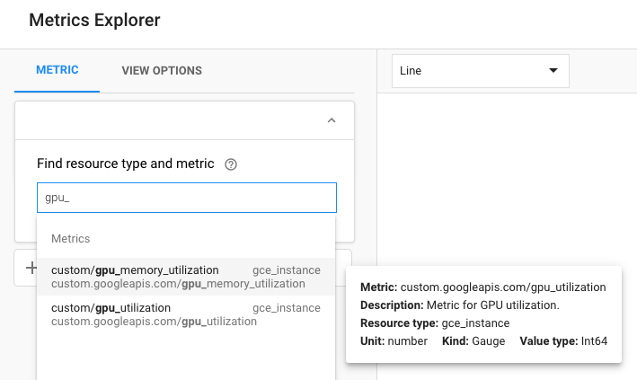

# gcp-gpu-monitor
This is a GPU Utilization Monitoring Container for reporting metrics from VM instances with GPU to Google Cloud StackDriver.
This is a [Depend on Docker](https://github.com/bhgedigital/depend-on-docker) project.

# Usage

1. Run the container on any VM that has NVIDIA GPU available

```
./run.sh
```

2. Test that GPU Utilization reporting works

Run a workload on your GPU or use the gpu_burn utility as follows to generate load.

docker run --rm laboroai/gpu-burn bash -c "gpu-burn/gpu_burn 3600"

3. Configure Dashboard in GCP Console

Go to GCP Console -> Stackdriver -> Monitoring

Click on Resources -> Metrics Explorer

Type "custom/gpu" in the "Find resource type and metric" textbox.



You will see two metrics available: custom/gpu_memory_utilization and custom/gpu_utilization

Create charts and dashboards and/or use these metrics for auto-scaling as needed.


